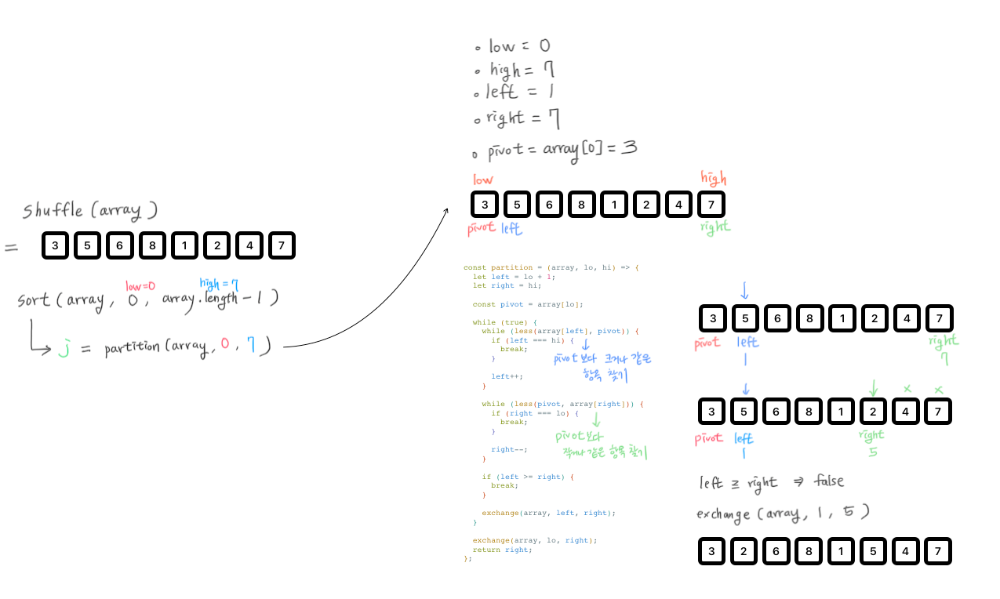
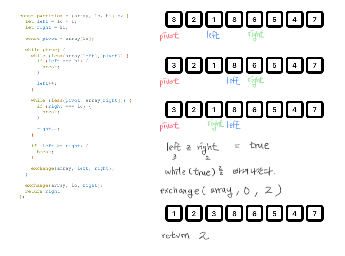
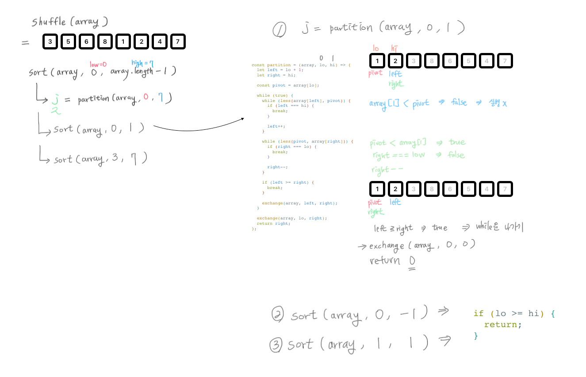
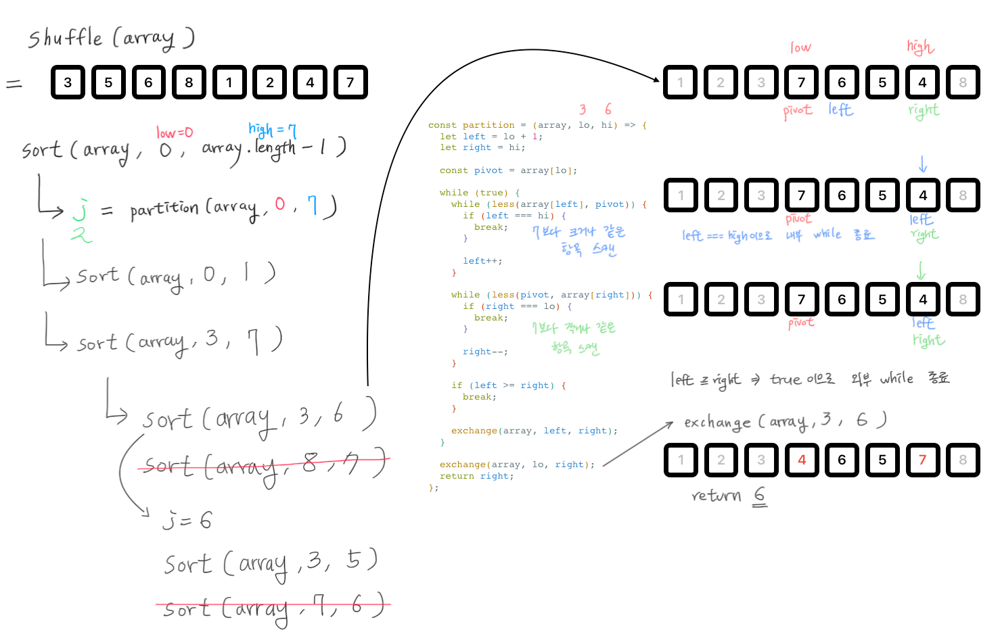

# 자료구조와 알고리즘 3주차 과제 - 퀵 정렬 구현하기

1. 다음은 퀵 정렬의 알고리즘입니다. 알고리즘을 보고 다음 값이 주어졌을 때
   어떻게 정렬이 되는지 그림으로 그려보세요.

> 1. 임의의 항목을 분할 기준 항목으로 선택한다
> 2. 배열의 왼쪽 끝부터 기준보다 크거나 같은 항목을 만날때까지 스캔한다
> 3. 배열의 오른쪽 끝부터 스캔하면서 기준보다 작거나 같은 항목을 만날때까지 스캔한다
> 4. 찾은 두 값을 교환한다. 그런데 만약 인덱스가 교차하면 왼쪽 항목들 중에서 가장 오른쪽에 있는 항목과 교환한다.
> 5. 기준 항목 왼쪽과 오른쪽을 위 내용을 반복한다

```
3, 5, 6, 8, 1, 2, 4, 7
```

2. 퀵 정렬의 코드를 보고 어떻게 동작하는지 그림을 그려보세요. 마찬가지로 위의 값이 주어졌다고 했을 때 코드를 따라가며 그림을 그려가며 이해해 보세요.








3. 퀵 정렬의 코드를 직접 구현해 주세요.
